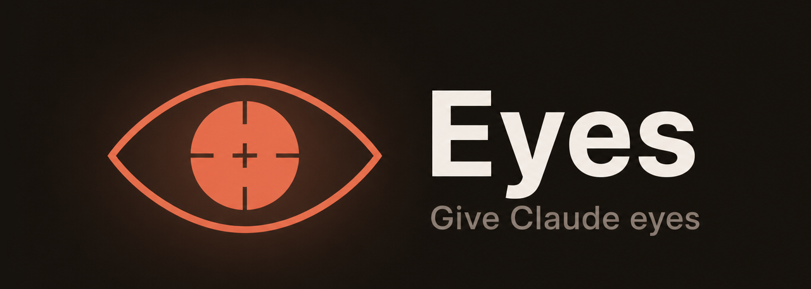

# Eyes

**Give Claude eyes.** Eyes is a Claude Code plugin that lets Claude open a
site or web app, navigate and interact with it like a real user, and
report back the bugs it finds — broken layout, accessibility issues,
console and network errors — instead of you having to check manually.

## Installation

```
claude plugin marketplace add gerefloc45/Eyes-Claude
claude plugin install eyes@eyes
```

Or, from inside a Claude Code session:

```
/plugin marketplace add gerefloc45/Eyes-Claude
/plugin install eyes@eyes
```

Restart Claude Code after installing so the plugin's MCP server connects.
The plugin ships pre-built, so no `npm install` step is needed.

**One-time browser setup:** Eyes drives a real headless Chromium browser
via Playwright. If you've never installed a Playwright browser before,
download it once:

```
npx --yes playwright install chromium
```

If Chromium is already installed from another Playwright project, Eyes
reuses it and you can skip this step. Without it, the first `/eyes` run
will fail with an error asking you to run the command above.

## Usage

```
/eyes <url>
/eyes <path-to-project>
/eyes
```

- `/eyes <url>` — points Eyes at an app that's already running.
- `/eyes <path-to-project>` — Eyes detects how to start the project and
  launches it for you.
- `/eyes` with no arguments — uses the current working directory.

Eyes auto-detects Node.js, Django, Flask, FastAPI, Rails, and plain
static (`index.html`) projects. See [Known limitations](#known-limitations)
for what it can't do yet.

## What it does

- **Launches or connects** to the app under test.
- **Navigates and interacts** like a user would — clicking links and
  buttons, filling in forms — guided by Claude's own judgment.
- **Captures screenshots** at desktop, tablet, and mobile viewports to
  catch responsive-design bugs.
- **Runs an accessibility audit** on every page via [axe-core](https://github.com/dequelabs/axe-core).
- **Checks for visual issues**: content overflow, elements pushed
  off-canvas, insufficient color contrast (WCAG AA).
- **Collects console and network errors** as it browses.
- **Stays safe by design** — a guardrail blocks destructive-looking
  actions (delete/pay/checkout buttons), links to external domains, and
  entering credentials into login/signup forms, so Eyes can explore
  without you worrying it'll do something it shouldn't.
- **Reports back** in a structured, severity-ranked format you can act on
  immediately.

## How it works

- An MCP server (`mcp-server/`) exposes six tools — `start_app`,
  `open_page`, `screenshot`, `click`, `fill`, `stop_app` — built on
  [Playwright](https://playwright.dev/).
- The `/eyes` skill (`skills/eyes/SKILL.md`) instructs Claude to drive
  the exploration step by step: look at each screenshot and the
  automated audit data, decide what's worth exploring next, interact
  with the page, and repeat — then compose a final report.

Example report output:

```
# Eyes — Analysis Report: my-app

## Summary
4 pages analyzed, 3 issues found (1 critical, 2 minor)

## Issues by page
### /home
- 🔴 [Critical] "Buy" button doesn't respond to clicks
- 🟡 [Accessibility] Insufficient contrast on menu link (axe-core: color-contrast)

### /products
- 🟡 [Minor] Footer text truncated on mobile viewport (375px)
```

## Requirements

- Node.js 18+
- Chromium installed via Playwright — see the one-time browser setup
  step under [Installation](#installation).

## Known limitations

- Default budget: at most 8 pages and 15 interactions per run, to keep
  exploration bounded.
- No guardrail bypass in v1 — the safety checks described above always
  apply.
- Docker Compose projects aren't auto-started yet: detection fails
  immediately with a clear error instead of trying and timing out — use
  the `url` parameter to point at an app you've started manually.
- Full design details and rationale live in
  [`docs/superpowers/specs/2026-08-19-eyes-plugin-design.md`](docs/superpowers/specs/2026-08-19-eyes-plugin-design.md).

## Development

```
cd mcp-server
npm install
npx playwright install chromium
npm test
```

The test suite (64 tests) runs against a real headless Chromium browser
and real spawned processes — no mocks.

## License

[MIT](LICENSE)
